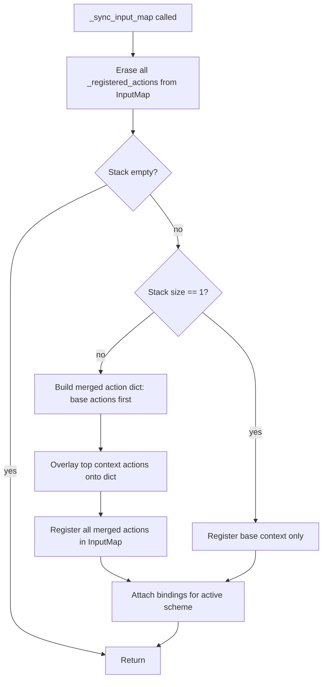

# Design Document — Base Context Merging

## Overview

This feature modifies the `_sync_input_map()` method in `input_system.gd` so that the base context (index 0 in `_context_stack`) is always merged with the topmost context when registering actions in Godot's `InputMap`. Today, only the top context's actions are registered, which means global actions like "pause" and "toggle_mode" disappear when a gameplay context is pushed.

The change is surgical: only `_sync_input_map()` needs to be rewritten. No new files, classes, or resources are introduced. The merge follows a simple rule — start with the base context's actions and bindings, then layer the top context on top, overriding any action names that collide.

### Key Design Decisions

- **Merge only base + top, not the entire stack.** Intermediate contexts are ignored. This keeps the logic simple and predictable. The requirements explicitly state only the base and top contexts participate.
- **Override granularity is per-action-name.** If the top context defines "pause", the entire ActionDefinition and all bindings for "pause" come from the top context. There is no partial merge of individual events within a single action.
- **No changes to public API.** `push_context()`, `pop_context()`, signals, and all public getters remain identical. Only the internal sync behavior changes.

## Architecture

The architecture is unchanged at the class level. The InputSystem node still owns a `_context_stack`, a `_bindings_registry`, and calls `_sync_input_map()` whenever the stack or scheme changes.

The only structural change is inside `_sync_input_map()`:



The merge is performed in-place using a temporary `Dictionary` keyed by action name. Base context entries are inserted first, then top context entries overwrite any collisions.

## Components and Interfaces

### Modified: `InputSystem._sync_input_map()`

This is the only method that changes. Its new responsibilities:

1. Erase all previously registered actions from `InputMap`.
2. If the stack is empty, return.
3. Identify the base context (`_context_stack[0]`) and the top context (`_context_stack.back()`).
4. If base == top (stack size 1), register only that context's actions and bindings (current behavior, no duplication).
5. Otherwise, build a merged action set:
   - Insert all base context `ActionDefinition`s into a `Dictionary` keyed by `action_name`.
   - Insert all top context `ActionDefinition`s into the same dictionary, overwriting collisions.
6. Register every action in the merged dictionary into `InputMap`.
7. Build a merged binding list for the active scheme:
   - Start with base context bindings, indexed by `action_name`.
   - Overlay top context bindings, overwriting collisions.
8. Attach each merged binding's events to `InputMap`.

### Unchanged Components

| Component | Why unchanged |
|---|---|
| `InputContextBindings` | Data container — no logic to change. |
| `ActionDefinition` | Pure data resource. |
| `ActionBinding` | Pure data resource. |
| `CsvBindingsParser` | Parses CSV into per-context resources. Merging is a runtime concern, not a parse-time concern. |
| `push_context()` / `pop_context()` | Already call `_sync_input_map()` — the new merge logic is picked up automatically. |
| `_input()` | Calls `_sync_input_map()` on scheme change — works as before. |

## Data Models

No new data models are introduced. The existing resources are sufficient:

- **`InputContextBindings`** — holds `context_name`, `actions: Array[ActionDefinition]`, `gamepad_bindings: Array[ActionBinding]`, `keyboard_mouse_bindings: Array[ActionBinding]`.
- **`ActionDefinition`** — holds `action_name: String`, `action_type: ActionType`.
- **`ActionBinding`** — holds `action_name: String`, `events: Array[InputEvent]`.

### Transient Merge Structures (local variables inside `_sync_input_map`)

| Variable | Type | Purpose |
|---|---|---|
| `merged_actions` | `Dictionary` (String → ActionDefinition) | Union of base + top actions, top wins on collision. |
| `merged_bindings` | `Dictionary` (String → ActionBinding) | Union of base + top bindings for the active scheme, top wins on collision. |

These are created and discarded each time `_sync_input_map()` runs. No persistent state is added to the class.

## Correctness Properties

*A property is a characteristic or behavior that should hold true across all valid executions of a system — essentially, a formal statement about what the system should do. Properties serve as the bridge between human-readable specifications and machine-verifiable correctness guarantees.*

### Property 1: Merged action set equals the union of base and top action names

*For any* base context with action names B and any top context with action names T (where base ≠ top), after syncing InputMap the set of registered action names should equal B ∪ T — every base action and every top action is present, with no extras and no omissions.

**Validates: Requirements 1.1, 5.1, 5.2, 6.1**

### Property 2: Top context wins on name collision

*For any* base context and top context that share at least one action name, the registered binding events and ActionDefinition (action_type) for each colliding action should match the top context's definition, not the base context's.

**Validates: Requirements 2.1, 2.2**

### Property 3: Non-overridden base actions retain base definitions and bindings

*For any* base context action whose name does not appear in the top context, the registered binding events for that action should match the base context's binding events for the active scheme, and the action_type should match the base context's ActionDefinition.

**Validates: Requirements 1.3, 2.3**

### Property 4: Scheme-aware binding selection during merge

*For any* base context, top context, and input scheme (GAMEPAD or KEYBOARD_MOUSE), the bindings registered in InputMap should come exclusively from the corresponding scheme's binding arrays (`gamepad_bindings` or `keyboard_mouse_bindings`) of the base and top contexts — never from the other scheme.

**Validates: Requirements 3.1, 3.2**

### Property 5: No duplicate action registrations

*For any* context stack state with at least one context, the list of registered action names should contain no duplicates — each action name appears exactly once.

**Validates: Requirements 6.2**

## Error Handling

The merge logic introduces no new error conditions. The existing error handling in `InputSystem` already covers:

| Scenario | Existing behavior | Change needed |
|---|---|---|
| Empty context stack | `_sync_input_map()` returns early after clearing. | None — same early return applies. |
| Unknown context name in `push_context()` | Warning logged, push ignored. | None. |
| Pop with only one context | Warning logged, pop ignored. | None — base context protection already exists. |
| Binding references unknown action | Warning logged, binding skipped. | None — the warning loop already iterates `_registered_actions`, which will now include merged actions. |

The only subtle case is if the base context has zero actions (degenerate but valid). The merge logic handles this naturally: the merged set simply equals the top context's actions, which is the current behavior.

## Testing Strategy

### Unit Tests

Unit tests should cover specific concrete scenarios using the project's existing test pattern (a `Node` script with `_ready()` calling test functions and using `assert()`):

- **Single context on stack**: push only "base", verify exactly base actions are registered, no duplication.
- **Two contexts, no overlap**: push "base" then "isometric", verify all base + isometric actions are registered.
- **Two contexts, with overlap**: create a top context that redefines "pause", verify the top's binding is used.
- **Pop back to base**: push a context, then pop it, verify only base actions remain.
- **Scheme switch while merged**: push two contexts, switch scheme, verify bindings update to the new scheme for both base and top actions.

### Property-Based Tests

Property-based tests validate the correctness properties above across many randomly generated inputs. Since this is a Godot 4 / GDScript project without a native PBT library, property tests will be implemented as GDScript test functions that use randomized generation loops (minimum 100 iterations each) to create random `InputContextBindings` with random action names, types, and bindings, then assert the properties hold.

Each property test must:
- Run a minimum of 100 iterations with randomized inputs.
- Reference its design property in a comment tag.
- Generate random `InputContextBindings` resources with varying numbers of actions, some overlapping and some unique.

Tag format for each test:

```
## Feature: base-context-merging, Property 1: Merged action set equals the union of base and top action names
```

| Property | Test approach |
|---|---|
| Property 1 (union) | Generate random base and top contexts with random action name sets. Sync. Assert registered actions == set union. |
| Property 2 (top wins) | Generate contexts with forced overlapping action names but different action_types and binding events. Sync. Assert colliding actions use top's values. |
| Property 3 (base retained) | Generate contexts with some non-overlapping base actions. Sync. Assert those actions use base's binding events. |
| Property 4 (scheme-aware) | Generate contexts with distinct gamepad vs keyboard bindings. Sync under each scheme. Assert only the correct scheme's bindings are attached. |
| Property 5 (no duplicates) | Generate random contexts. Sync. Assert `_registered_actions` has no duplicate entries. |
