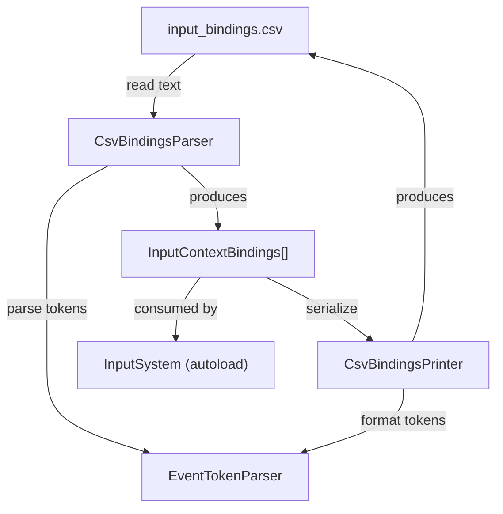

# Design Document: CSV Input Bindings

## Overview

This feature replaces hand-authored `.tres` resource files with a single CSV file as the source of truth for all input bindings. The system introduces three new GDScript classes:

1. **CsvBindingsParser** — reads a CSV string and produces `InputContextBindings` resources identical to those the existing `InputSystem` already consumes.
2. **CsvBindingsPrinter** — serializes an array of `InputContextBindings` resources back into a CSV string, enabling migration from `.tres` files and round-trip verification.
3. **EventTokenParser** — a small utility that converts between human-readable event token strings (e.g. `key:W`, `joy_button:0`) and Godot `InputEvent` objects.

The existing `InputSystem` autoload gains a new exported property (`csv_bindings_path`) and a small startup hook that delegates to `CsvBindingsParser` before pushing the initial context. No changes are required to `InputContextBindings`, `ActionDefinition`, or `ActionBinding`.

### Design Rationale

- **Single file, flat format**: CSV is diffable, grep-able, and editable in any spreadsheet tool. One file for all contexts eliminates the need to cross-reference multiple `.tres` files.
- **Token syntax over raw codes**: `key:W` is self-documenting compared to `keycode = 87`. The token vocabulary is small and closed (four event types), so parsing is straightforward.
- **No runtime dependency change**: The parser produces the same resource types the system already uses, so the context stack, scheme detection, and InputMap sync remain untouched.

## Architecture



### Data Flow

1. **Startup**: `InputSystem._ready()` reads the CSV file at `csv_bindings_path` as a raw string, passes it to `CsvBindingsParser.parse()`.
2. **Parsing**: `CsvBindingsParser` splits lines, validates the header, iterates rows, groups by context, and calls `EventTokenParser` to convert cell tokens into `InputEvent` objects. Returns `Array[InputContextBindings]` plus an `Array[String]` of errors.
3. **Registration**: `InputSystem` iterates the returned resources and registers each in `_bindings_registry` by `context_name`, then proceeds with its existing `push_context(initial_context)` flow.
4. **Migration (offline)**: `CsvBindingsPrinter.print_csv()` accepts `Array[InputContextBindings]` and returns a CSV string. This is a developer tool, not called at runtime.

### File Placement

| File | Path |
|------|------|
| CsvBindingsParser | `res://scripts/input/csv_bindings_parser.gd` |
| CsvBindingsPrinter | `res://scripts/input/csv_bindings_printer.gd` |
| EventTokenParser | `res://scripts/input/event_token_parser.gd` |
| CSV data file | `res://input/input_bindings.csv` |
| Tests | `res://tests/test_csv_bindings.gd` |

## Components and Interfaces

### EventTokenParser

A static utility class. No state.

```gdscript
class_name EventTokenParser
extends RefCounted

## Converts a single event token string to an InputEvent.
## Returns [InputEvent, ""] on success, or [null, "error message"] on failure.
static func token_to_event(token: String) -> Array:
    pass

## Converts an InputEvent to its canonical token string.
## Returns "" if the event type is not supported.
static func event_to_token(event: InputEvent) -> String:
    pass
```

**Token formats:**

| Token Pattern | InputEvent Type | Example |
|---|---|---|
| `key:<KeyName>` | `InputEventKey` | `key:W` → keycode 87 |
| `mouse_button:<Index>` | `InputEventMouseButton` | `mouse_button:1` → left click |
| `joy_button:<Index>` | `InputEventJoypadButton` | `joy_button:0` → A button |
| `joy_axis:<Axis>:<Value>` | `InputEventJoypadMotion` | `joy_axis:0:-1.0` → left stick left |

Key name resolution uses `OS.find_keycode_from_string()` for named keys (e.g. `Escape`, `Space`, `Tab`) and single uppercase letters map directly to their ASCII keycode (A=65 .. Z=90). The printer uses `OS.get_keycode_string()` to convert back.

### CsvBindingsParser

```gdscript
class_name CsvBindingsParser
extends RefCounted

## Result of a parse operation.
class ParseResult:
    var bindings: Array[InputContextBindings] = []
    var errors: Array[String] = []

## Parses a CSV string and returns a ParseResult.
static func parse(csv_text: String) -> ParseResult:
    pass
```

**Parsing algorithm:**
1. Split `csv_text` on newlines, strip trailing whitespace from each line, discard empty lines.
2. Validate the first non-empty line matches the expected header: `context,action,action_type,gamepad,keyboard_mouse`.
3. For each subsequent row, split on commas (respecting that pipe-separated tokens never contain commas).
4. Validate `action_type` is one of `BOOL`, `AXIS`, `VECTOR2`.
5. Check for duplicate `(context, action)` pairs.
6. Parse `gamepad` and `keyboard_mouse` cells: split on `|`, trim each token, call `EventTokenParser.token_to_event()`.
7. Group rows by `context`. For each context, build one `InputContextBindings` with its `actions`, `gamepad_bindings`, and `keyboard_mouse_bindings`.
8. Return `ParseResult` with all successfully built resources and any accumulated errors.

### CsvBindingsPrinter

```gdscript
class_name CsvBindingsPrinter
extends RefCounted

## Serializes an array of InputContextBindings into a CSV string.
static func print_csv(contexts: Array[InputContextBindings]) -> String:
    pass
```

**Printing algorithm:**
1. Sort contexts alphabetically by `context_name`.
2. Emit the header line.
3. For each context, iterate its `actions` array. For each action:
   - Look up the matching `ActionBinding` in `gamepad_bindings` and `keyboard_mouse_bindings` by `action_name`.
   - Convert each binding's events to tokens via `EventTokenParser.event_to_token()`, join with ` | `.
   - Emit the CSV row: `context_name,action_name,ACTION_TYPE,gamepad_tokens,keyboard_tokens`.

### InputSystem Changes

Minimal additions to the existing `input_system.gd`:

```gdscript
## Path to the CSV bindings file. When non-empty, CSV loading is used
## instead of scanning the .tres directory.
@export var csv_bindings_path: String = ""
```

In `_ready()`, before the existing `_load_bindings_from_directory()` call:
- If `csv_bindings_path` is non-empty, read the file, call `CsvBindingsParser.parse()`, register results, log errors via `push_error()`, and skip the directory scan.
- If `csv_bindings_path` is empty, fall back to the existing `.tres` directory loading (backward compatible).

## Data Models

### CSV File Schema

```
context,action,action_type,gamepad,keyboard_mouse
base,pause,BOOL,joy_button:6,key:Escape
base,toggle_mode,BOOL,joy_button:4,key:Tab
isometric,select,BOOL,joy_button:0,mouse_button:1
isometric,camera_pan,VECTOR2,joy_axis:0:-1.0 | joy_axis:0:1.0 | joy_axis:1:-1.0 | joy_axis:1:1.0,key:W | key:S | key:A | key:D
isometric,camera_zoom_in,BOOL,joy_button:13,mouse_button:4
isometric,camera_zoom_out,BOOL,joy_button:12,mouse_button:5
```

Each row maps 1:1 to:
- One `ActionDefinition` (from `action`, `action_type`)
- Zero or one `ActionBinding` in `gamepad_bindings` (from `gamepad` cell)
- Zero or one `ActionBinding` in `keyboard_mouse_bindings` (from `keyboard_mouse` cell)

### Event Token Grammar

```
token       := key_token | mouse_token | joy_btn_token | joy_axis_token
key_token   := "key:" key_name
mouse_token := "mouse_button:" integer
joy_btn_token := "joy_button:" integer
joy_axis_token := "joy_axis:" integer ":" float
key_name    := <string accepted by OS.find_keycode_from_string(), e.g. "W", "Escape", "Space">
integer     := [0-9]+
float       := "-"? [0-9]+ ("." [0-9]+)?
```

### Existing Resources (unchanged)

| Resource | Key Fields |
|---|---|
| `ActionDefinition` | `action_name: String`, `action_type: ActionType` (BOOL=0, AXIS=1, VECTOR2=2) |
| `ActionBinding` | `action_name: String`, `events: Array[InputEvent]` |
| `InputContextBindings` | `context_name: String`, `actions: Array[ActionDefinition]`, `gamepad_bindings: Array[ActionBinding]`, `keyboard_mouse_bindings: Array[ActionBinding]` |

### ParseResult

| Field | Type | Description |
|---|---|---|
| `bindings` | `Array[InputContextBindings]` | Successfully parsed context resources |
| `errors` | `Array[String]` | Human-readable error messages with row numbers |


## Correctness Properties

*A property is a characteristic or behavior that should hold true across all valid executions of a system — essentially, a formal statement about what the system should do. Properties serve as the bridge between human-readable specifications and machine-verifiable correctness guarantees.*

### Property 1: Event token round-trip

*For any* supported `InputEvent` (InputEventKey, InputEventMouseButton, InputEventJoypadButton, InputEventJoypadMotion), converting it to a token string via `EventTokenParser.event_to_token()` and then parsing back via `EventTokenParser.token_to_event()` shall produce an InputEvent equivalent to the original.

**Validates: Requirements 2.1, 2.2, 2.3, 2.4**

### Property 2: Whitespace insignificance in token cells

*For any* valid CSV row, adding arbitrary whitespace around event tokens and pipe separators in the `gamepad` and `keyboard_mouse` cells shall produce the same parsed `InputContextBindings` as the version without extra whitespace.

**Validates: Requirements 2.5**

### Property 3: Parser produces one context per unique context name

*For any* valid CSV string containing N distinct context values, the parser shall return exactly N `InputContextBindings` resources, each with a unique `context_name` matching one of the N values.

**Validates: Requirements 3.1**

### Property 4: Printer output is alphabetically ordered by context

*For any* array of `InputContextBindings` resources, the CSV string produced by `CsvBindingsPrinter.print_csv()` shall have its data rows grouped by context name in ascending alphabetical order.

**Validates: Requirements 6.4**

### Property 5: Printer output has correct header and row count

*For any* array of `InputContextBindings` resources with a total of M actions across all contexts, the CSV string produced by `CsvBindingsPrinter.print_csv()` shall have exactly M+1 lines (1 header + M data rows), and the first line shall be `context,action,action_type,gamepad,keyboard_mouse`.

**Validates: Requirements 1.2, 6.1**

### Property 6: Print-then-parse round-trip

*For any* valid array of `InputContextBindings` resources (where each action name is unique within its context and all events are of supported types), printing with `CsvBindingsPrinter` then parsing with `CsvBindingsParser` shall produce `InputContextBindings` resources semantically equivalent to the originals (same context names, same action names and types, same events per binding).

**Validates: Requirements 7.2**

### Property 7: Parse-then-print-then-parse round-trip

*For any* valid CSV string, parsing with `CsvBindingsParser`, printing the result with `CsvBindingsPrinter`, then parsing again shall produce `InputContextBindings` resources equivalent to the first parse result.

**Validates: Requirements 7.1**

## Error Handling

### Parser Errors

The `CsvBindingsParser` accumulates errors in `ParseResult.errors` without aborting early, so that a single parse pass reports all problems:

| Condition | Error Message Format | Requirement |
|---|---|---|
| Missing/wrong header | `"Line 1: expected header 'context,action,action_type,gamepad,keyboard_mouse' but got '<actual>'"` | 4.1 |
| Invalid action_type | `"Line <N>: unrecognized action_type '<value>', expected BOOL, AXIS, or VECTOR2"` | 4.2 |
| Invalid event token | `"Line <N>, column '<col>': unrecognized event token '<token>'"` | 4.3 |
| Duplicate action in context | `"Line <N>: duplicate action '<action>' in context '<context>'"` | 4.4 |
| Empty/unreadable input | `"CSV input is empty or could not be read (path: '<path>')"` | 4.5 |

### InputSystem Error Handling

When `csv_bindings_path` is set and the parser returns errors:
- Each error string is logged via `push_error()`.
- Any successfully parsed contexts are still registered in `_bindings_registry`.
- If the `initial_context` is among the failed contexts, `push_error()` is called and the system starts with an empty stack (existing behavior for missing initial context).

### EventTokenParser Error Handling

- `token_to_event()` returns `[null, "error message"]` for unrecognized token formats. The caller (CsvBindingsParser) wraps this into a row-level error.
- `event_to_token()` returns `""` for unsupported InputEvent types. The printer skips these silently (they shouldn't exist in well-formed bindings).

## Testing Strategy

### Testing Framework

- **Unit/integration tests**: GDScript test scripts using Godot's built-in `assert` and the existing test scene infrastructure.
- **Property-based tests**: Use the existing `InputGenerators` helper class to generate random `InputContextBindings`, `ActionDefinition`, `ActionBinding`, and `InputEvent` instances. Each property test runs a loop of **100+ iterations** with randomized inputs.
- **PBT library**: Since Godot/GDScript has no dedicated PBT framework, property tests are implemented as loop-based randomized tests using the existing `InputGenerators` class. Each iteration generates fresh random data and asserts the property.

### Unit Tests (specific examples and edge cases)

- **Error cases** (Requirements 4.1–4.5): One test per error condition with a hand-crafted invalid CSV string, asserting the error message contains the expected information.
- **Integration** (Requirements 5.1–5.3): Test that `InputSystem` correctly delegates to the parser, registers contexts, and logs errors. Uses a test scene or mock setup.
- **Empty binding cells** (Requirement 1.5): Test that an action with an empty gamepad cell produces no gamepad binding but still has a keyboard binding (and vice versa).
- **Known CSV migration**: Parse the CSV equivalent of the existing `base.tres`, `isometric.tres`, and `third_person.tres` files and verify the resulting resources match.

### Property Tests

Each property test must:
1. Run a minimum of 100 iterations
2. Use `InputGenerators` for random data generation
3. Include a comment tag referencing the design property

| Test | Property | Tag |
|---|---|---|
| `test_event_token_round_trip` | Property 1 | `Feature: csv-input-bindings, Property 1: Event token round-trip` |
| `test_whitespace_insignificance` | Property 2 | `Feature: csv-input-bindings, Property 2: Whitespace insignificance in token cells` |
| `test_parser_context_count` | Property 3 | `Feature: csv-input-bindings, Property 3: Parser produces one context per unique context name` |
| `test_printer_alphabetical_order` | Property 4 | `Feature: csv-input-bindings, Property 4: Printer output is alphabetically ordered by context` |
| `test_printer_header_and_row_count` | Property 5 | `Feature: csv-input-bindings, Property 5: Printer output has correct header and row count` |
| `test_print_parse_round_trip` | Property 6 | `Feature: csv-input-bindings, Property 6: Print-then-parse round-trip` |
| `test_parse_print_parse_round_trip` | Property 7 | `Feature: csv-input-bindings, Property 7: Parse-then-print-then-parse round-trip` |

### Test Data Generation

The existing `InputGenerators` class already provides `random_input_event()`, `random_action_definition()`, `random_action_binding()`, and `random_input_context_bindings()`. For CSV-specific tests, we'll extend or wrap these to:
- Generate random valid CSV strings (by generating random `InputContextBindings` and printing them)
- Add random whitespace to token cells for Property 2
- Ensure generated action names are unique within a context (required for valid input)

### Equivalence Comparison

Since Godot resources don't have built-in deep equality, tests will compare `InputContextBindings` by checking:
- `context_name` equality
- `actions` array: same length, matching `action_name` and `action_type` for each element
- `gamepad_bindings` / `keyboard_mouse_bindings`: same length, matching `action_name` and event count/type/properties for each binding
