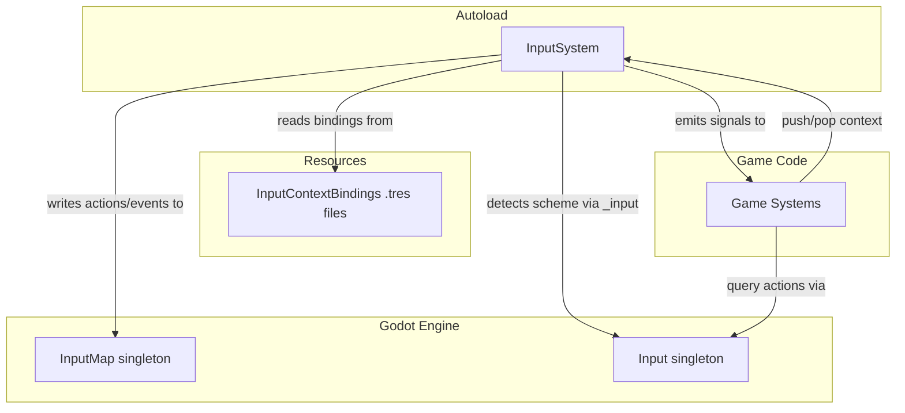
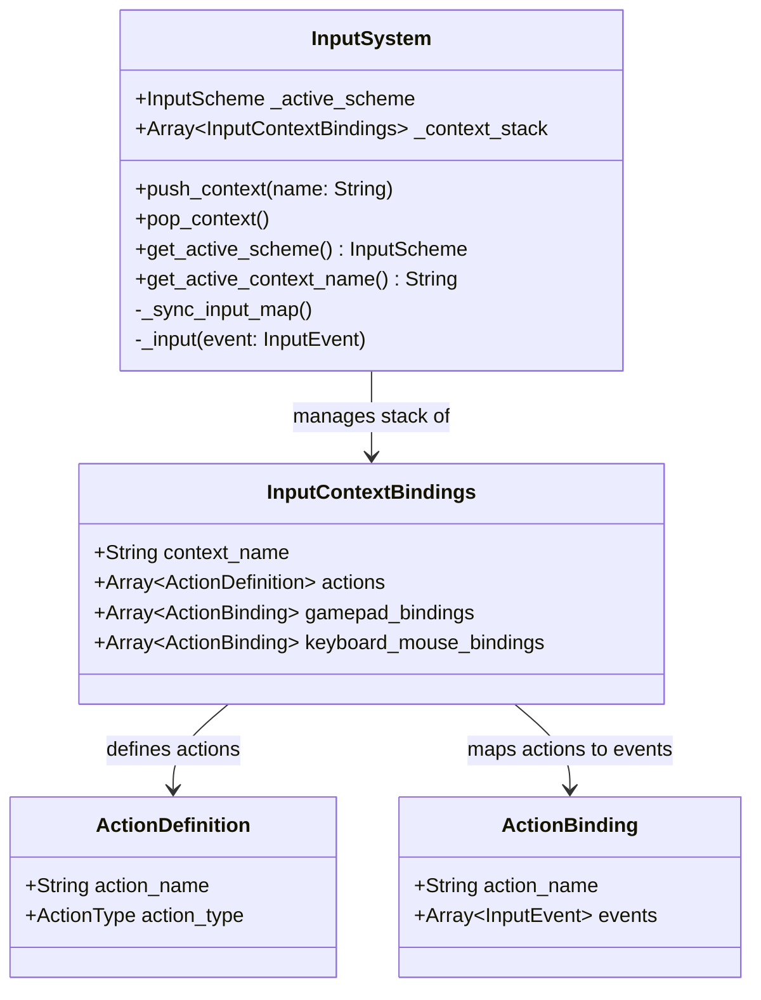

# Design Document: Input System

## Overview

The Input System is a lightweight GDScript layer on top of Godot 4.x's native `InputMap` and `Input` singletons. It provides three things the engine doesn't ship out of the box:

1. A context stack that swaps InputMap bindings when gameplay modes change (isometric ↔ 3rd-person ↔ menus).
2. Automatic scheme detection that tracks whether the player is currently on gamepad or keyboard/mouse.
3. A data-driven binding format so designers can add or tweak controls without touching code.

The system is intentionally minimal. It does not handle rebinding, UI prompts, multiplayer isolation, or hot-plug — those are deferred features that the architecture accommodates without refactoring.

### Key Design Decisions

- **Build on Godot, don't replace it.** All action queries go through `Input.is_action_pressed`, `Input.get_axis`, `Input.get_vector`. The system only manages *which* events are mapped at any given time.
- **Single autoload entry point.** One `InputSystem` autoload node owns the context stack, scheme state, and binding loader. Game code interacts with it through a small public API.
- **Resource files for bindings.** Each context's bindings live in a `.tres` resource file (custom `InputContextBindings` resource), making them editable in the Godot inspector and diffable in version control.
- **Signals for reactivity.** Scheme changes and context changes emit signals so UI and other systems can react without polling.

## Architecture



### Data Flow

1. **Startup:** `InputSystem._ready()` loads all `InputContextBindings` resources, pushes the initial context, and syncs InputMap for the default scheme.
2. **Runtime input:** Godot routes raw events through `InputSystem._input(event)`. The system checks if the event implies a scheme switch. If so, it switches scheme and re-syncs InputMap. Godot's `Input` singleton handles the rest — game code queries actions normally.
3. **Context change:** Game code calls `InputSystem.push_context("third_person")` or `InputSystem.pop_context()`. The system clears current InputMap events, loads the new top context's bindings for the active scheme, and registers them.
4. **Signals:** `active_scheme_changed(scheme)` and `context_changed(context_name)` fire so UI or other systems can respond.

## Components and Interfaces

### InputSystem (Autoload Node)

The single entry point. Extends `Node`, registered as an autoload.

```gdscript
class_name InputSystem
extends Node

signal active_scheme_changed(scheme: InputScheme)
signal context_changed(context_name: String)

enum InputScheme { GAMEPAD, KEYBOARD_MOUSE }
enum ActionType { BOOL, AXIS, VECTOR2 }

# --- State ---
var _active_scheme: InputScheme = InputScheme.KEYBOARD_MOUSE
var _context_stack: Array[InputContextBindings] = []
var _bindings_registry: Dictionary = {}  # context_name -> InputContextBindings

# --- Public API ---
func push_context(context_name: String) -> void
func pop_context() -> void
func get_active_scheme() -> InputScheme
func get_active_context_name() -> String

# --- Internal ---
func _ready() -> void           # load resources, push initial context
func _input(event: InputEvent) -> void  # scheme detection
func _sync_input_map() -> void  # clear + rebuild InputMap for top context + active scheme
```

**Public API details:**

| Method | Description |
|---|---|
| `push_context(name)` | Pushes a named context onto the stack. Calls `_sync_input_map()`. Emits `context_changed`. |
| `pop_context()` | Pops the top context. Calls `_sync_input_map()`. Emits `context_changed`. No-op if stack has only one context (always keep a base). |
| `get_active_scheme()` | Returns the current `InputScheme` enum value. |
| `get_active_context_name()` | Returns the `name` of the topmost `InputContextBindings`. |

### InputContextBindings (Resource)

A custom `Resource` subclass that holds all bindings for one context across both schemes.

```gdscript
class_name InputContextBindings
extends Resource

@export var context_name: String = ""
@export var actions: Array[ActionDefinition] = []
@export var gamepad_bindings: Array[ActionBinding] = []
@export var keyboard_mouse_bindings: Array[ActionBinding] = []
```

### ActionDefinition (Resource)

Defines a single action's metadata. Stored inside `InputContextBindings.actions`.

```gdscript
class_name ActionDefinition
extends Resource

@export var action_name: String = ""
@export var action_type: InputSystem.ActionType = InputSystem.ActionType.BOOL
```

### ActionBinding (Resource)

Maps one action to one or more `InputEvent` resources for a specific scheme. Stored in the scheme-specific arrays of `InputContextBindings`.

```gdscript
class_name ActionBinding
extends Resource

@export var action_name: String = ""
@export var events: Array[InputEvent] = []
```

### Component Interaction Summary



## Data Models

### InputScheme Enum

```
GAMEPAD          = 0
KEYBOARD_MOUSE   = 1
```

Two values only. Future schemes (touch, motion) can be added to the enum without changing the stack or binding logic.

### ActionType Enum

```
BOOL    = 0   # pressed / released
AXIS    = 1   # -1.0 to 1.0 (single axis)
VECTOR2 = 2   # two-axis composite (e.g., movement stick)
```

### InputContextBindings Resource Layout

Each `.tres` file represents one context. Example file structure:

```
res://input/contexts/
    base.tres           # always-on context (pause, menu toggle)
    isometric.tres      # isometric mode bindings
    third_person.tres   # 3rd-person mode bindings
```

Example `base.tres` conceptual content:

```
context_name: "base"
actions:
  - { action_name: "pause", action_type: BOOL }
  - { action_name: "toggle_mode", action_type: BOOL }
gamepad_bindings:
  - { action_name: "pause", events: [JoypadButton(START)] }
  - { action_name: "toggle_mode", events: [JoypadButton(SELECT)] }
keyboard_mouse_bindings:
  - { action_name: "pause", events: [Key(ESCAPE)] }
  - { action_name: "toggle_mode", events: [Key(TAB)] }
```

### Scheme Detection Rules

The `_input(event)` method classifies events:

| Event Type | Classified As | Triggers Switch? |
|---|---|---|
| `InputEventJoypadButton` | GAMEPAD | Yes |
| `InputEventJoypadMotion` (above deadzone) | GAMEPAD | Yes |
| `InputEventKey` | KEYBOARD_MOUSE | Yes |
| `InputEventMouseButton` | KEYBOARD_MOUSE | Yes |
| `InputEventMouseMotion` | — | No (ignored) |

A switch only fires when the detected scheme differs from `_active_scheme`. On switch, `_sync_input_map()` is called and `active_scheme_changed` is emitted.

### Context Stack Behavior

| Operation | Stack Before | Stack After | InputMap Reflects |
|---|---|---|---|
| `push_context("third_person")` | `[base]` | `[base, third_person]` | `third_person` bindings |
| `push_context("menu")` | `[base, third_person]` | `[base, third_person, menu]` | `menu` bindings |
| `pop_context()` | `[base, third_person, menu]` | `[base, third_person]` | `third_person` bindings |
| `pop_context()` | `[base, third_person]` | `[base]` | `base` bindings |
| `pop_context()` | `[base]` | `[base]` | `base` bindings (no-op, can't pop last) |

Only the topmost context's bindings are active in InputMap at any time. Lower contexts are preserved on the stack but dormant.

### _sync_input_map() Algorithm

```
1. For each action registered in InputMap:
     InputMap.erase_action(action_name)
2. Get top context from _context_stack
3. For each ActionDefinition in top context:
     InputMap.add_action(action_name)
4. Get the binding array for _active_scheme (gamepad_bindings or keyboard_mouse_bindings)
5. For each ActionBinding in that array:
     For each InputEvent in binding.events:
         InputMap.action_add_event(action_name, event)
```

This runs in a single frame. The cost is proportional to the number of actions in the context (expected: <30), so performance is negligible.


## Correctness Properties

*A property is a characteristic or behavior that should hold true across all valid executions of a system — essentially, a formal statement about what the system should do. Properties serve as the bridge between human-readable specifications and machine-verifiable correctness guarantees.*

After analyzing all 20 acceptance criteria across the 5 requirements, 7 consolidated properties emerged. Several criteria were redundant (e.g., "register actions in InputMap" and "expose actions as named Actions" test the same invariant), and several are architectural constraints that aren't behaviorally testable (API choice, data format, frame timing).

### Property 1: Action Registration Completeness

*For any* `InputContextBindings` resource with N action definitions, after `_sync_input_map()` runs with that context on top of the stack, all N action names should exist as registered actions in Godot's `InputMap`.

**Validates: Requirements 1.1, 4.1**

### Property 2: Binding Correctness After Sync

*For any* `InputContextBindings` resource and *for any* `InputScheme` value, after `_sync_input_map()` runs, the set of `InputEvent`s registered in `InputMap` for each action should be exactly the events defined in that context's scheme-specific binding array — no more, no less.

**Validates: Requirements 1.2, 3.1, 3.2, 3.4, 4.2**

### Property 3: Context Stack Round-Trip

*For any* context stack state S and *for any* valid context name C, pushing C onto the stack and then immediately popping should result in the InputMap state being identical to the state before the push.

**Validates: Requirements 3.3**

### Property 4: Unbound Events Are Not Registered

*For any* `InputContextBindings` resource and *for any* `InputEvent` that does not appear in any `ActionBinding` of the active context+scheme, that event should not be mapped to any action in `InputMap`.

**Validates: Requirements 1.4**

### Property 5: Scheme Detection Correctness

*For any* starting `InputScheme` and *for any* qualifying `InputEvent` (JoypadButton, JoypadMotion above deadzone, Key, MouseButton — but NOT MouseMotion), if the event's scheme differs from the current active scheme, then after processing the event the active scheme should equal the event's scheme. If the event's scheme matches the current active scheme, the active scheme should remain unchanged.

**Validates: Requirements 2.1, 2.2, 2.3**

### Property 6: Scheme Change Signal Emission

*For any* scheme switch triggered by a qualifying event, the `active_scheme_changed` signal should be emitted exactly once with the new `InputScheme` value as its argument. When a qualifying event matches the already-active scheme, no signal should be emitted.

**Validates: Requirements 2.4**

### Property 7: Default Binding Coverage

*For all* `ActionDefinition` entries in every initial `InputContextBindings` resource, both the `gamepad_bindings` array and the `keyboard_mouse_bindings` array should contain at least one `ActionBinding` whose `action_name` matches the action definition's `action_name`.

**Validates: Requirements 5.1, 5.2**

## Error Handling

### Context Stack Errors

| Scenario | Behavior |
|---|---|
| `push_context()` with unknown context name | Log a warning via `push_warning()`. Do not modify the stack. |
| `pop_context()` when stack has only one context | No-op. Log a warning. The base context is never removed. |
| `pop_context()` on empty stack | Should never happen (base context guard), but if it does: log error, do nothing. |

### Binding Errors

| Scenario | Behavior |
|---|---|
| `ActionBinding` references an `action_name` not in the context's `actions` array | Skip the binding during `_sync_input_map()`. Log a warning. |
| `InputContextBindings` resource file missing or corrupt | Log error at startup. Skip that context. System continues with remaining contexts. |
| Action with no bindings for the active scheme | Action is registered in InputMap but has no events. Godot handles this gracefully — queries return default (false/0.0). |

### Scheme Detection Errors

| Scenario | Behavior |
|---|---|
| Event type not recognized (custom InputEvent subclass) | Ignore. Don't switch scheme. |
| JoypadMotion below deadzone | Ignore. Treat as noise, not a qualifying event. |

### General Principles

- Never crash. All error paths log and continue.
- Use `push_warning()` for recoverable issues, `push_error()` for things that indicate a data problem.
- The system should be functional even if some resources are missing — degrade gracefully.

## Testing Strategy

### Dual Testing Approach

The input system requires both unit tests and property-based tests for comprehensive coverage.

**Unit tests** cover:
- Specific examples: initializing with known `.tres` files and verifying exact InputMap state
- Edge cases: popping the last context, pushing the same context twice, empty binding arrays
- Integration: verifying `_ready()` loads resources and sets up initial state correctly
- Signal wiring: verifying signals connect and fire in integration scenarios

**Property-based tests** cover:
- Universal invariants across all valid inputs (Properties 1–7 above)
- Randomized context/scheme/binding combinations to catch edge cases humans miss

### Property-Based Testing Configuration

- **Library:** [GdUnit4](https://github.com/MikeSchulze/gdUnit4) for the test runner, with a custom `PropertyTest` helper that generates random inputs and runs assertions over 100+ iterations.
- Since GDScript doesn't have a mature PBT library like QuickCheck, the property tests will use a lightweight generator approach: helper functions that produce random `InputContextBindings`, `ActionDefinition`, `ActionBinding`, and `InputEvent` instances, then assert properties over them in a loop.
- **Minimum iterations:** 100 per property test.
- **Tag format:** Each test includes a comment referencing its design property:
  ```
  # Feature: input-system, Property 1: Action Registration Completeness
  ```

### Test Organization

```
res://tests/
    test_input_system.gd          # unit tests
    test_input_system_props.gd    # property-based tests
    helpers/
        input_generators.gd       # random generators for PBT
```

### Property Test Mapping

| Property | Test | Generator Inputs |
|---|---|---|
| 1: Action Registration | Verify all action names in InputMap after sync | Random ActionDefinition arrays (1–20 actions, random names/types) |
| 2: Binding Correctness | Verify InputMap events match context+scheme bindings exactly | Random contexts with random bindings per scheme |
| 3: Stack Round-Trip | Push then pop, compare InputMap state before and after | Random initial stack + random context to push |
| 4: Unbound Events | Verify unbound events are absent from InputMap | Random context + random events NOT in bindings |
| 5: Scheme Detection | Feed qualifying events, verify scheme switches correctly | Random starting scheme + random qualifying events |
| 6: Signal Emission | Count signal emissions on scheme changes | Random event sequences with scheme switches |
| 7: Default Coverage | Load default resources, verify all actions have bindings in both schemes | The shipped `.tres` files (data-driven, so this validates the actual data) |
