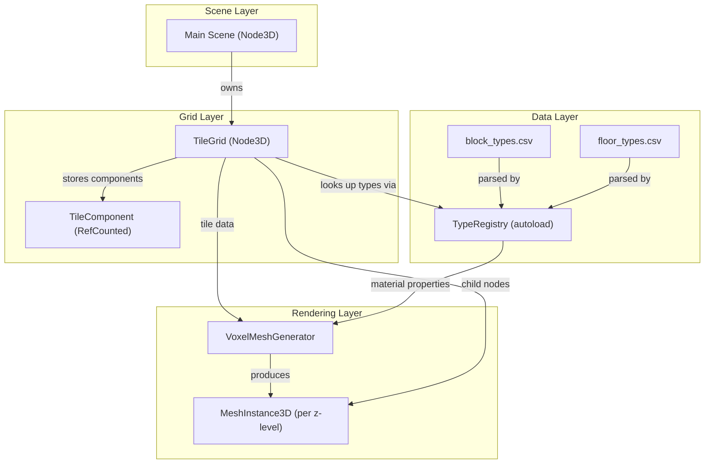

# Design Document: Tile Grid System

## Overview

The tile grid system is the spatial foundation of Hiveminders — a 3D voxel grid that stores terrain, floors, and modular components for an isometric dungeon game. The system comprises four core subsystems:

1. **TileGrid** — a flat-array-backed 3D grid (default 128×128×8 = ~131K tiles) that stores tile data and exposes a coordinate-validated API for querying and modifying blocks, floors, and components.
2. **TypeRegistry** — a singleton that loads block and floor type definitions from CSV files (`res://data/block_types.csv` and `res://data/floor_types.csv`), consistent with the CSV-driven pattern established by the csv-input-bindings feature. Definitions are available by string identifier at runtime.
3. **VoxelMeshGenerator** — a per-z-level mesh builder that uses `SurfaceTool` to produce `ArrayMesh` geometry with hidden-face culling. Blocks render as unit cubes; floors render as thin slabs (1/8th block height).
4. **TileComponent** — a `RefCounted`-based base class for modular data attachments on tiles (resource nodes, devices, light sources, etc.).

### Design Rationale

- **Flat array over nested Dictionary**: A `PackedInt32Array` (or parallel arrays) for block/floor type IDs gives O(1) coordinate-to-index lookup via `index = x + y * x_size + z * x_size * y_size`. Dictionaries would add hash overhead per access on 131K+ tiles.
- **Integer type IDs over Resource references per tile**: Storing a small int per tile (2 bytes for block + 2 bytes for floor) keeps memory tight. The `TypeRegistry` maps IDs to full definitions only when needed.
- **Per-z-level mesh generation**: Changing one tile only regenerates its z-level's mesh (~16K tiles) rather than the full grid. This is a practical granularity for a game where most edits happen on one level at a time.
- **CSV files for type definitions**: Consistent with the csv-input-bindings feature, type definitions are stored in plain CSV files. CSV is diffable, grep-able, and editable in any spreadsheet tool or the Godot CSV editor plugin. No custom `.tres` resource classes are needed for on-disk storage — the TypeRegistry creates in-memory definition objects directly from CSV rows.
- **SurfaceTool for mesh building**: Godot's `SurfaceTool` handles vertex/normal/UV generation and produces `ArrayMesh` directly. It's the standard approach for procedural geometry in Godot 4.

## Architecture



### Data Flow

1. **Startup**: `TypeRegistry` autoload reads and parses `block_types.csv` and `floor_types.csv`, creating in-memory `BlockTypeDef` and `FloorTypeDef` objects for each row. Main scene instantiates `TileGrid` with dimensions (or uses defaults). `TileGrid` allocates flat arrays and initializes all tiles to air block / empty floor.
2. **Tile Modification**: Game systems call `TileGrid.set_block()` or `TileGrid.set_floor()`. The grid validates coordinates, enforces structural invariants (blocks require floors), stores the new type ID, and marks the affected z-level as dirty.
3. **Mesh Regeneration**: On the next frame (or on explicit request), dirty z-levels are rebuilt by `VoxelMeshGenerator`. For each tile in the z-level, the generator checks neighbor adjacency for face culling, emits cube geometry for blocks and slab geometry for visible floors, and assigns materials from `TypeRegistry`.
4. **Component Access**: Game systems call `TileGrid.add_component()` / `TileGrid.remove_component()` / `TileGrid.get_components()` to attach modular data to tiles.

### File Placement

| File | Path |
|------|------|
| TileGrid | `res://scripts/world/tile_grid.gd` |
| VoxelMeshGenerator | `res://scripts/world/voxel_mesh_generator.gd` |
| TileComponent | `res://scripts/world/tile_component.gd` |
| TypeRegistry | `res://scripts/world/type_registry.gd` |
| BlockTypeDef | `res://scripts/world/block_type_def.gd` |
| FloorTypeDef | `res://scripts/world/floor_type_def.gd` |
| Block types CSV | `res://data/block_types.csv` |
| Floor types CSV | `res://data/floor_types.csv` |
| Tests | `res://tests/test_tile_grid.gd` |

## Components and Interfaces

### BlockTypeDef

An in-memory data object representing a block material type. Created by `TypeRegistry` when parsing CSV rows — not saved as a `.tres` resource.

```gdscript
class_name BlockTypeDef
extends RefCounted

## Unique string identifier (e.g. "stone", "dirt", "air").
var type_id: String = ""

## Human-readable name shown in UI.
var display_name: String = ""

## The color/material used for rendering this block's faces.
## Created from the hex color in the CSV. Null for air.
var material: StandardMaterial3D = null

## Whether this type represents empty space (air).
var is_air: bool = false
```

### FloorTypeDef

An in-memory data object representing a floor material type. Created by `TypeRegistry` when parsing CSV rows — not saved as a `.tres` resource.

```gdscript
class_name FloorTypeDef
extends RefCounted

## Unique string identifier (e.g. "stone", "dirt", "empty").
var type_id: String = ""

## Human-readable name shown in UI.
var display_name: String = ""

## The color/material used for rendering this floor slab.
## Created from the hex color in the CSV. Null for empty.
var material: StandardMaterial3D = null

## Whether this type represents no floor (empty).
var is_empty: bool = false
```

### TypeRegistry

Autoload singleton that loads and indexes type definitions from CSV files.

```gdscript
class_name TypeRegistry
extends Node

@export var block_types_path: String = "res://data/block_types.csv"
@export var floor_types_path: String = "res://data/floor_types.csv"

## ID -> BlockTypeDef
var _block_types: Dictionary = {}
## ID -> FloorTypeDef
var _floor_types: Dictionary = {}

## Returns the BlockTypeDef for the given type_id, or null if not found.
func get_block_type(type_id: String) -> BlockTypeDef:
    pass

## Returns the FloorTypeDef for the given type_id, or null if not found.
func get_floor_type(type_id: String) -> FloorTypeDef:
    pass

## Returns all registered block type IDs.
func get_block_type_ids() -> Array[String]:
    pass

## Returns all registered floor type IDs.
func get_floor_type_ids() -> Array[String]:
    pass
```

**CSV parsing logic** (in `_ready()`):
1. Read the CSV file as a raw string via `FileAccess.open()`.
2. Split on newlines, discard empty lines.
3. Validate the header row matches the expected columns (`type_id,display_name,is_air,color` for blocks; `type_id,display_name,is_empty,color` for floors).
4. For each data row, split on commas, create a `BlockTypeDef` or `FloorTypeDef`, and populate its fields.
5. For the `color` column: if non-empty, create a `StandardMaterial3D` with `albedo_color` set to `Color(hex_string)`. If empty, set `material` to `null`.
6. Register the definition in `_block_types` or `_floor_types` by `type_id`.
7. Log errors via `push_error()` for malformed rows but continue parsing remaining rows.

Built-in types loaded at startup from CSV: `air`, `stone`, `dirt` for blocks; `empty`, `stone`, `dirt` for floors.

### TileComponent

Base class for modular tile attachments.

```gdscript
class_name TileComponent
extends RefCounted

## Returns a string identifying the component type (overridden by subclasses).
func get_component_type() -> String:
    return ""
```

### TileGrid

The core grid data structure. Extends `Node3D` so it can be placed in the scene tree and own child `MeshInstance3D` nodes for rendering.

```gdscript
class_name TileGrid
extends Node3D

## Grid dimensions — configurable via inspector or constructor.
@export var x_size: int = 128
@export var y_size: int = 128
@export var z_size: int = 8

## Flat arrays indexed by _index(x, y, z).
## Stores block type_id strings.
var _block_ids: PackedStringArray
## Stores floor type_id strings.
var _floor_ids: PackedStringArray
## Stores component lists. Dictionary keyed by flat index -> Array[TileComponent].
var _components: Dictionary = {}
## Tracks which z-levels need mesh regeneration.
var _dirty_levels: Dictionary = {}

## Converts (x, y, z) to flat array index.
func _index(x: int, y: int, z: int) -> int:
    return x + y * x_size + z * x_size * y_size

## Returns true if (x, y, z) is within grid bounds.
func is_in_bounds(x: int, y: int, z: int) -> bool:
    pass

## Returns the block type_id at (x, y, z), or "" on out-of-bounds.
func get_block(x: int, y: int, z: int) -> String:
    pass

## Sets the block type at (x, y, z). Enforces structural invariants.
## Returns true on success, false on out-of-bounds.
func set_block(x: int, y: int, z: int, type_id: String) -> bool:
    pass

## Returns the floor type_id at (x, y, z), or "" on out-of-bounds.
func get_floor(x: int, y: int, z: int) -> String:
    pass

## Sets the floor type at (x, y, z). Enforces structural invariants.
## Returns true on success, false on out-of-bounds.
func set_floor(x: int, y: int, z: int, type_id: String) -> bool:
    pass

## Adds a component to the tile at (x, y, z). No-op if duplicate instance.
## Returns true on success, false on out-of-bounds.
func add_component(x: int, y: int, z: int, component: TileComponent) -> bool:
    pass

## Removes a component from the tile at (x, y, z).
## Returns true if removed, false if not found or out-of-bounds.
func remove_component(x: int, y: int, z: int, component: TileComponent) -> bool:
    pass

## Returns the component list for the tile at (x, y, z).
## Returns an empty array on out-of-bounds or no components.
func get_components(x: int, y: int, z: int) -> Array:
    pass

## Returns a 2D Dictionary of tile data for a z-level: {x: {y: {block, floor, components}}}.
## Returns null if z is out of bounds.
func get_z_level(z: int):
    pass

## Initializes the grid arrays. Called from _ready() or explicitly.
func initialize() -> void:
    pass
```

### VoxelMeshGenerator

Static utility that builds meshes from tile data.

```gdscript
class_name VoxelMeshGenerator
extends RefCounted

## Height of a floor slab relative to a full block (1.0).
const FLOOR_HEIGHT_RATIO: float = 0.125  # 1/8th

## Generates an ArrayMesh for a single z-level of the grid.
## Returns the mesh, or null if the level is entirely air with no floors.
static func generate_z_level_mesh(grid: TileGrid, z: int) -> ArrayMesh:
    pass

## Checks if the face of a block at (x, y, z) facing the given direction
## should be rendered (i.e., the neighbor in that direction is air).
static func _should_render_face(grid: TileGrid, x: int, y: int, z: int,
                                 dir: Vector3i) -> bool:
    pass
```

**Face culling logic**: For each non-air block, check the 6 cardinal neighbors (+x, -x, +y, -y, +z, -z). If the neighbor is also a non-air block, skip that face. Boundary faces (at grid edges) are always rendered.

**Floor rendering logic**: A floor slab is rendered when the tile has a non-empty floor AND the block above it is air (or the tile is at the top z-level). The slab is a thin box of height `FLOOR_HEIGHT_RATIO` positioned at the bottom of the tile cell. Floor faces shared with an adjacent block of matching material are culled.

**Material assignment**: Each face gets the `StandardMaterial3D` from the corresponding `BlockTypeDef` or `FloorTypeDef` via `TypeRegistry`. Faces with different materials go into separate `SurfaceTool` surfaces within the same `ArrayMesh`.

## Data Models

### Tile Storage

Each tile is represented by two parallel flat arrays plus a sparse component dictionary:

| Array | Type | Size | Content |
|-------|------|------|---------|
| `_block_ids` | `PackedStringArray` | `x_size * y_size * z_size` | Block type_id per tile |
| `_floor_ids` | `PackedStringArray` | `x_size * y_size * z_size` | Floor type_id per tile |
| `_components` | `Dictionary` | Sparse (only tiles with components) | `int -> Array[TileComponent]` |

**Index formula**: `index = x + y * x_size + z * x_size * y_size`

For default dimensions (128×128×8): 131,072 entries per array. `PackedStringArray` stores string references efficiently in Godot.

### Type Definition CSV Files

Block and floor types are defined in CSV files at `res://data/block_types.csv` and `res://data/floor_types.csv`.

**Block types CSV** (`res://data/block_types.csv`):

```csv
type_id,display_name,is_air,color
air,Air,true,
stone,Stone,false,#808080
dirt,Dirt,false,#8B6914
```

| Column | Type | Description |
|--------|------|-------------|
| `type_id` | String | Unique identifier (e.g. `"stone"`, `"air"`) |
| `display_name` | String | Human-readable name |
| `is_air` | `true`/`false` | Whether this type represents empty space |
| `color` | Hex string or empty | Hex color (e.g. `#808080`) used to create a `StandardMaterial3D` at load time. Empty = no material (for air). |

**Floor types CSV** (`res://data/floor_types.csv`):

```csv
type_id,display_name,is_empty,color
empty,Empty,true,
stone,Stone,false,#808080
dirt,Dirt,false,#8B6914
```

| Column | Type | Description |
|--------|------|-------------|
| `type_id` | String | Unique identifier (e.g. `"stone"`, `"empty"`) |
| `display_name` | String | Human-readable name |
| `is_empty` | `true`/`false` | Whether this type represents no floor |
| `color` | Hex string or empty | Hex color (e.g. `#808080`) used to create a `StandardMaterial3D` at load time. Empty = no material (for empty). |

**Built-in block types:**

| type_id | display_name | is_air | color |
|---------|-------------|--------|-------|
| `"air"` | `"Air"` | `true` | *(empty)* |
| `"stone"` | `"Stone"` | `false` | `#808080` |
| `"dirt"` | `"Dirt"` | `false` | `#8B6914` |

**Built-in floor types:**

| type_id | display_name | is_empty | color |
|---------|-------------|----------|-------|
| `"empty"` | `"Empty"` | `true` | *(empty)* |
| `"stone"` | `"Stone"` | `false` | `#808080` |
| `"dirt"` | `"Dirt"` | `false` | `#8B6914` |

### Structural Invariants

The grid enforces one key invariant at all times:

**Block-requires-floor**: If a tile has a non-air block, it must have a non-empty floor.

This is enforced in two places:
- `set_block()`: When placing a non-air block on a tile with an empty floor, the floor is auto-set to match the block's type_id.
- `set_floor()`: When setting a floor to empty on a tile with a non-air block, the block is auto-set to air first.

### Dirty Level Tracking

When a tile is modified, its z-level is marked dirty in `_dirty_levels: Dictionary` (key = z index, value = `true`). The rendering system checks this dictionary to know which z-level meshes to regenerate.

## Error Handling

### CSV Parsing Errors (TypeRegistry)

The `TypeRegistry` logs errors via `push_error()` and continues parsing remaining rows, consistent with the csv-input-bindings pattern:

| Condition | Error Message Format |
|---|---|
| CSV file not found | `"TypeRegistry: could not open '<path>'"` |
| Missing/wrong header | `"TypeRegistry: '<path>' line 1: expected header '<expected>' but got '<actual>'"` |
| Wrong column count | `"TypeRegistry: '<path>' line <N>: expected 4 columns but got <M>"` |
| Invalid boolean value | `"TypeRegistry: '<path>' line <N>: invalid boolean '<value>' for column '<col>', expected 'true' or 'false'"` |
| Invalid hex color | `"TypeRegistry: '<path>' line <N>: invalid color '<value>', expected hex format (e.g. #808080)"` |
| Duplicate type_id | `"TypeRegistry: '<path>' line <N>: duplicate type_id '<id>'"` |
| Empty type_id | `"TypeRegistry: '<path>' line <N>: type_id cannot be empty"` |

If a CSV file cannot be opened at all, the registry starts with no types for that category. Game systems that depend on `"air"` or `"empty"` existing should check for null returns from `get_block_type()` / `get_floor_type()`.

### Grid Operation Errors

- Out-of-bounds coordinate access returns a failure indicator (`false`, `""`, `null`, or empty array depending on the method) without modifying state.
- Unknown type_id passed to `set_block()` / `set_floor()` is stored as-is (the grid stores string IDs, not validated references). The rendering layer handles unknown IDs gracefully by skipping geometry for types not found in the registry.

